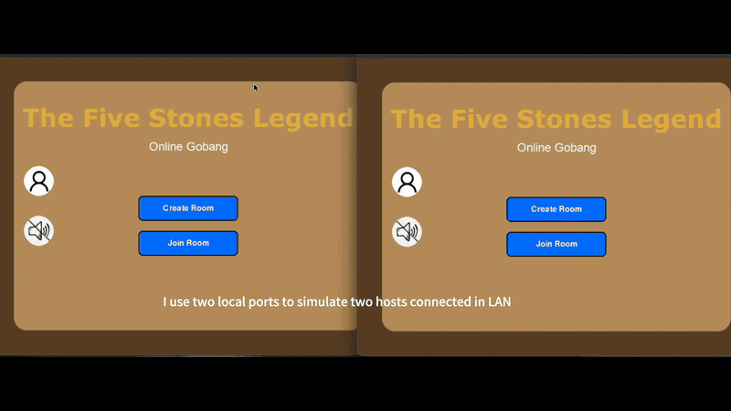
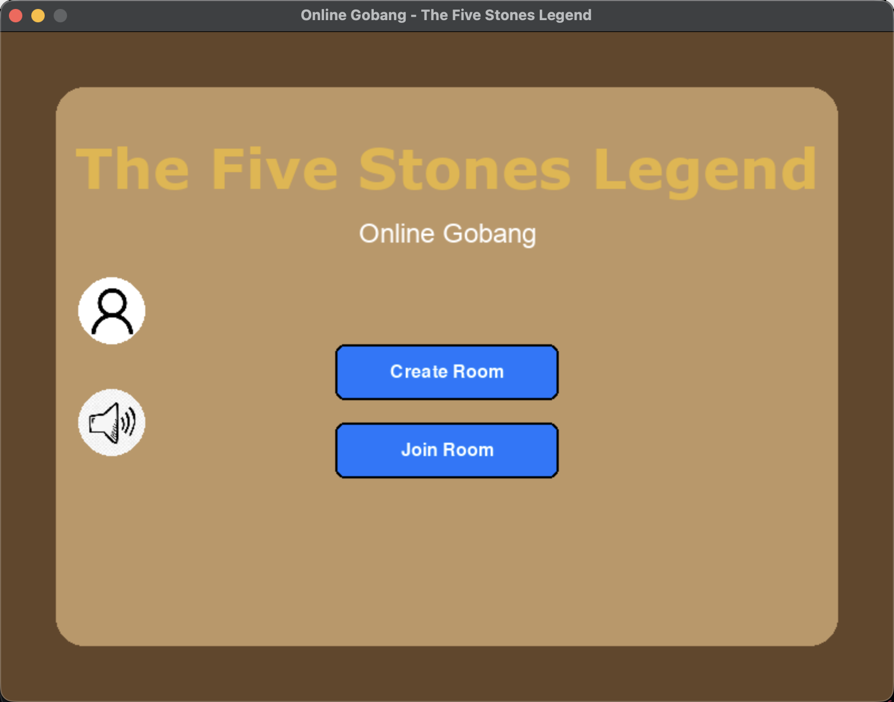
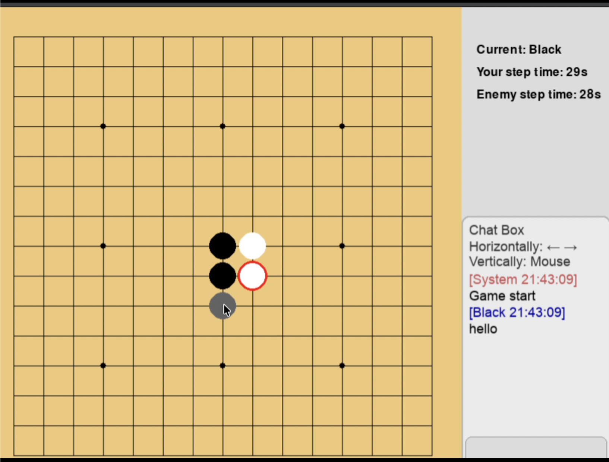

# Online Gobang

A Python/Pygame five-in-a-row game with peer-to-peer LAN rooms, synchronized moves, chat, timers, sound, and player statistics.

[中文说明](README_zh.md)

## Overview

The application presents a custom Pygame interface for creating or joining a LAN room. Its 15×15 game model supports turn-based placement, win/draw detection, chat messages, per-move timing, connection checks, and persisted player records.

## Demo

[](https://han-chh.github.io/Online-Gobang/demo.html)

[▶ Watch the full demo online](https://han-chh.github.io/Online-Gobang/demo.html)

The recording shows two running peers creating a room, synchronizing moves and chat, and completing a game.

## Screenshots

<p align="center">
  
  
</p>

## Features

- P2P LAN room creation and discovery
- 15×15 board and five-in-a-row detection
- Real-time move and chat messages
- Per-move countdown and timeout handling
- Sound controls and player statistics
- Custom Pygame UI components

## Run

```bash
pip install pygame
python3 main.py
```

Two peers on the same LAN are required to run the complete multiplayer path.
